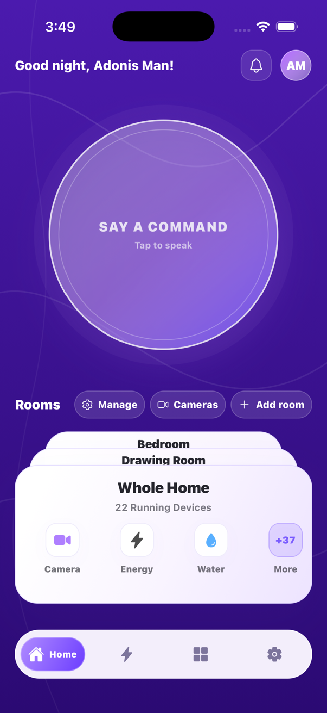
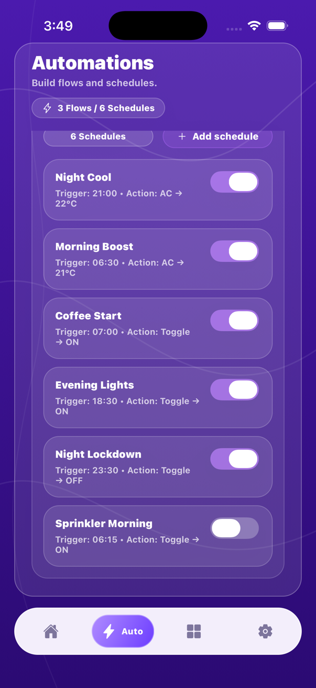
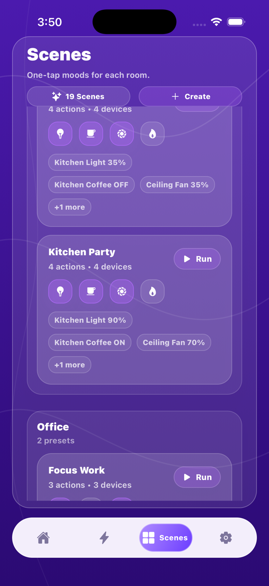
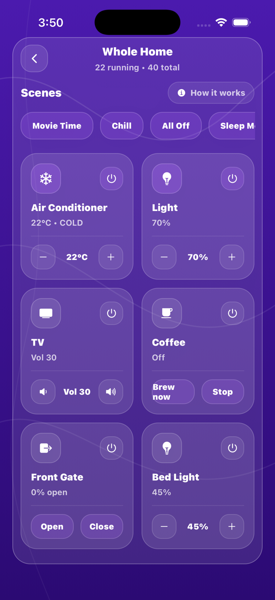
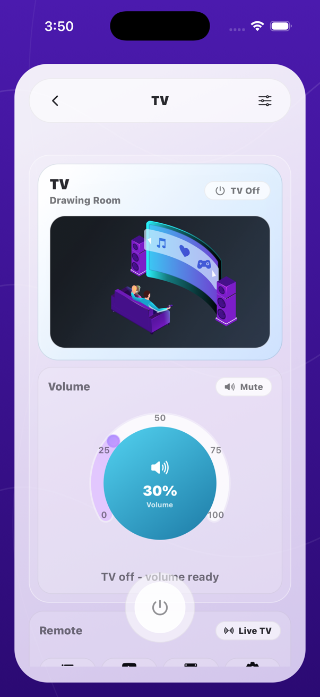
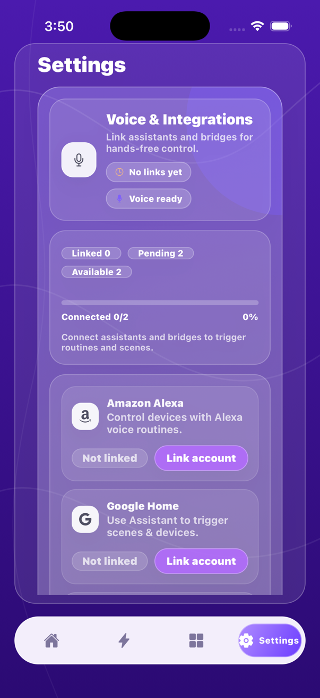
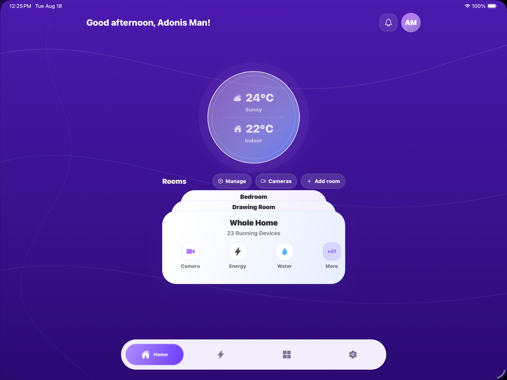
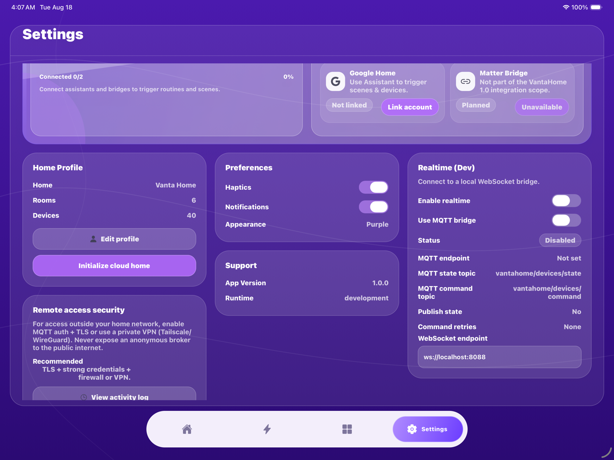

# vantahome

VantaHome is a premium smart-home client built with Expo and React Native. The
seeded demo remains available, while production architecture is moving toward a
local Vanta Bridge backed by Home Assistant. See
[`docs/PRODUCT_CONSTITUTION.md`](docs/PRODUCT_CONSTITUTION.md) and
[`docs/ARCHITECTURE.md`](docs/ARCHITECTURE.md). Development and review practices
are documented in [`CONTRIBUTING.md`](CONTRIBUTING.md).

The current roadmap is [private-home pilot first](docs/HOME_PILOT.md). The
owner-approved [pilot decision](docs/PRIVATE_PILOT_DECISION.md) defers independent
review only for supervised one-bulb testing after technical prerequisites and
separate session approval. Hardware readiness is not yet established; review
remains outstanding and required before any public/customer use.

## Features

- [3D Home](docs/THREE_D_HOME.md) as the main interface, with a furnished property,
  interactive simulated devices, weather effects, and a compact feature menu.
- Device detail screens for lights, climate, media, appliances, security camera, and front gate.
- Scenes and automations with device state previews and ON highlighting.
- Profile, settings, notifications, onboarding, and management flows.
- Tap-to-speak and typed simulation commands, plus assistant and bridge setup pages.
  External provider connections and physical device control remain unverified.

## Screenshots

These historical dashboard captures use VantaHome's explicitly labeled seeded demo
mode. The current app opens into the 3D home described above.
The phone views are portrait and the tablet views are landscape. No production
household data or credentials are shown.

| Home | Automations | Scenes |
| --- | --- | --- |
|  |  |  |

| Devices | Device controls | Integrations |
| --- | --- | --- |
|  |  |  |

### Tablet landscape

| Home | Settings and integrations |
| --- | --- |
|  |  |

## Tech stack

- Expo SDK 54 + React Native 0.81
- Zustand store for local state
- Expo vector icons + gradients for the UI

## Quick start

Node 20 LTS is recommended.

```bash
npm install
npm start
```

Run a specific platform:

```bash
npm run ios
npm run android
npm run web
```

### Low-storage iOS workflow

Docker is not required to build, test, or run the mobile client. Keep Docker
stopped during ordinary app development and use one installed iOS runtime with
one simulator device. Before a native build, keep at least 15 GB free; 20 GB or
more leaves safer headroom for Xcode's temporary files.

Use the Docker-free regression suite for routine verification:

```bash
npm run verify
```

Then run the app normally so Expo starts Metro and attaches the JavaScript
bundle to the simulator:

```bash
npm run ios
```

Keep Xcode's DerivedData after a successful build when space permits. It is a
small, rebuildable cache that makes later native builds substantially faster.
If storage becomes tight, remove old simulator runtimes in Xcode's Components
settings and delete DerivedData in Xcode's Locations settings. Do not keep
multiple runtimes solely for VantaHome.

The full local Supabase/self-hosted stack is intentionally outside this lean
workflow because it requires Docker and significantly more disk. Use a remote
disposable Supabase project for database integration testing until the machine
has comfortable storage headroom.

## Realtime dev server

Use the loopback-only synthetic server for demo/development checks in
Settings → Realtime (Dev):

```bash
npm run realtime:server
```

Use `ws://127.0.0.1:8088` from the same host. This unauthenticated mock server is
not a private-pilot or household control transport. Do not expose it on the LAN
or Internet to connect a phone; the pilot requires the authenticated local
bridge described in the readiness checklist.

## MQTT presence simulator

Send a one-off presence event over MQTT (useful for motion/camera sensor flows):

```bash
npm run mqtt:presence -- --url mqtt://localhost:1883 --room-name "Drawing Room"
```

Options:

- `--url` (or `EXPO_PUBLIC_MQTT_URL`)
- `--topic` (or `EXPO_PUBLIC_MQTT_TOPIC_STATE`, default: `vantahome/devices/state`)
- `--room` / `--room-name` (room is resolved from `roomsSeed` when possible)
- `--device` (fallback if no room id)
- `--kind` (known | unknown)
- `--source` (motion | camera | sensor)

The simulator CLI can read `MQTT_USERNAME` and `MQTT_PASSWORD`. Broker secrets
must never use `EXPO_PUBLIC_*` variables or ship in the mobile binary. Direct
mobile MQTT is limited to demo/development mode and will be replaced by an
authenticated Vanta Bridge WSS/HTTPS connection in alpha/production.

## Data and configuration

Seed data (devices, scenes, automations) lives in `src/store/useHomeStore.ts`.

## Auth (Google/Apple)

Social auth is powered by Supabase Auth. Set these in `.env`:

- `EXPO_PUBLIC_SUPABASE_URL`
- `EXPO_PUBLIC_SUPABASE_ANON_KEY`

Then add your redirect URIs in Supabase → Auth → URL Configuration:

- `vantahome://auth-callback` (standalone/dev client)
- The Expo Go redirect returned by `AuthSession.makeRedirectUri()` (when using Expo Go)

Email/password uses Supabase Auth as well. If email confirmation is enabled in Supabase, new users will need to verify before signing in. Password reset emails are sent from Supabase.

## Self-hosted stack

See `docs/self-hosted/README.md` for the NUC + Frigate + CompreFace + Double Take setup.
